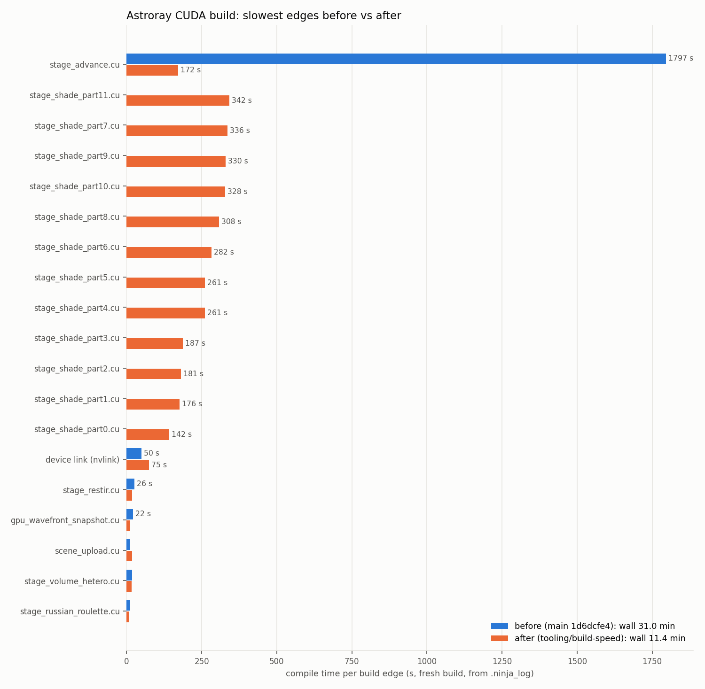

# Build-speed directive (2026-09-30)

Owner request 2026-09-29: build time is the largest bottleneck. This note gives
the measurements, the ranked levers, what landed on `tooling/build-speed`, and
what is deferred.

## 1. Measurements (before)

Sources: `.ninja_log` from four fresh lane builds (al-293, am-962 twice,
buildspeed), and one instrumented fresh build of `main` 1d6dcfe4 with
`CUDAFLAGS="--time <csv>"` via `lead_build_queue.py buildspeed`.
Hardware: Ryzen 7 7800X3D (8 cores), 63 GB, RTX 5070 Ti, CUDA 12.8, Ninja, sm_120.

| Build | Wall | `stage_advance.cu` | Device link | Everything else | Parallelism |
|---|---:|---:|---:|---:|---:|
| al-293 fresh | 1637 s | 1579 s | 49 s | done by t=47 s | 1.19 |
| am-962 fresh | 1774 s | 1713 s | 50 s | done by t=43 s | 1.18 |
| am-962 after guard WIPE | 2122 s | 2037 s | 73 s | done by t=47 s | 1.14 |
| buildspeed fresh (instrumented) | 1858 s (1874 s incl. configure + guard) | 1797 s | 50 s | done by t=56 s | 1.23 |

`stage_advance.cu` phase split (nvcc `--time`): **cicc 910 s + ptxas 834 s**,
host `cl` 42 s, fatbinary 6 s. Both device phases are single-threaded. ptxas
peaked at 8.4 GB RSS.

Findings:

- **Critical path is one TU.** `stage_advance.cu` is 96 % of the wall. It holds
  the 128 `stageShadeBucketedKernel<P,T,Ph,D,LP,Prog,NP>` variants, each inlining
  the REG:254 `shadePathSlot`, plus the intersect, shadow, env-shadow, NEE-MIS,
  regen and volume kernels. The other ~120 edges (all other `.cu` files and the
  C++ plugins) finish in under a minute on 8 cores. Then 7 cores sit idle
  for ~29 minutes.
- **Device link** (`nvlink`, `-rdc`) is 44-73 s and serial. The `.pyd` link is
  5-7 s.
- **Incremental cost is bimodal.** A change to a non-`stage_advance` `.cu` costs
  the TU (≤ 26 s), the device link (~50 s) and the link (~6 s), about 1.5 min.
  A change to any header `stage_advance.cu` reaches (`gpu_types.h`,
  `gpu_materials.h`, `shader_vm.h`, `gpu_bvh.h`, `gpu_nee.cuh`, ...) costs the
  full 30 min. So does a pkg183 guard WIPE, which fires on every layout-critical
  header change. In practice every GPU lane pays the full 30 min.
- **Fresh worktrees start from zero.** The lead queue strips the sccache shim
  from PATH, because sccache dropped the >10 min `stage_advance.cu` compile.
  So no lane reuses any object from another lane.
- **The MinGW CPU build does not duplicate the CUDA work.** It is a separate
  host-only build. `build_blender_addon.py --backend cuda` is a second, fully
  separate CUDA build (OpenMP OFF), so it pays the same 30 min again.
- **The upcoming work makes it worse.** pkg300 (shade-kernel specialisation)
  adds axes to the same template family. At one TU, each new axis doubles the
  critical path.

## 2. Ranked levers

Savings are for a fresh full CUDA build unless stated.

| # | Lever | Expected saving | Risk | Status |
|---|---|---|---|---|
| 1 | **Split `stage_advance.cu`**: shared device header plus N shade-part TUs with explicit instantiations and extern launchers; `__constant__` symbols defined once, `extern __constant__` elsewhere (`-rdc` makes this legal) | critical path 1800 s → the slowest part (≈ 1/8 of the shade work + header parse) | Kernel codegen must stay identical. Gate: `cuobjdump -res-usage` REG/STACK per kernel | **applied** (see §3) |
| 2 | Ninja job pool (≤ 6) for the heavy CUDA TUs | none; it caps RAM (8 × ~2-8 GB ptxas) and load; this machine hard-reset twice under combined load | none | **applied** |
| 3 | `nvcc -split-compile=N` on the heavy TUs (cicc and ptxas both honour it in 12.8) | up to N× on each part | "minimal impact" on codegen per NVIDIA; must pass the same kernel-identity gate | deferred: with the pool saturated it only oversubscribes (§3b) |
| 4 | **sccache back on for CUDA** with `SCCACHE_IDLE_TIMEOUT=0` (the default 600 s idle timeout is the likely cause of the "connection reset ~10-12 min" drop) and `SCCACHE_BASEDIR=%CD%` for cross-worktree hits. After lever 1 no TU nears 10 min anyway. | a lane whose diff doesn't reach a shade part rebuilds only what changed. A CPU-only lane's fresh CUDA build becomes host compiles + device link, about 2 min. | cache poisoning is bounded by sccache's hash of preprocessed input + flags. pkg183 guard stays. Escape hatch `ASTRORAY_NO_SCCACHE=1` | **applied in branch; active after merge** (the queue runs main's copy) |
| 5 | Fix the CPU-only carve-out in `classify.py`: treat any header transitively `#include`d from a `src/gpu` `.cu/.cuh` (and `CMakeLists.txt`, `cmake/`) as CUDA | correctness of HW-gate routing. It is also the classifier a future "skip CUDA" fast path would use | low | **applied** |
| 6 | Device-only SASS (`120-real`, no embedded `compute_120` PTX) for native lane builds | fatbinary step + smaller `.pyd` (165 MB) + possibly a few s of nvlink | loses the PTX-JIT fallback used by pkg155-style experiments. Kernels are unchanged | deferred (small) |
| 7 | Re-split shade parts further, or by measured cost, once pkg300 adds axes | keeps the critical path flat as variants grow | none | deferred; the pattern is in place |
| 8 | `build_blender_addon.py --backend cuda` shares the sccache (identical `.cu` flags) | a second 30 min build becomes cache hits | flags must match exactly; verify hit rate | deferred; follows lever 4 |
| 9 | Drop `-rdc` / use device LTO | device link 50-70 s | large refactor; LTO changes codegen, so it conflicts with the kernel-identity gate | not recommended now |
| 10 | Precompiled headers for host C++ | < 30 s (host side is off the critical path) | low | not worth it |
| 11 | Generator change | none: builds already use Ninja (the directive brief assumed NMake) | — | n/a |
| 12 | `--threads` | none: it only parallelises across multiple arches; we build one | — | n/a |

**CUDA 13 (pkg300 Phase 0 trial, owner-approved):** don't run it here. The
split makes a toolkit A/B cheap (one ~N-minute rebuild instead of 30). pkg300
should record build time next to its REG/STACK/perf numbers, since ptxas time
may shift with the toolkit.

**Kept protections:** pkg183 `build_guard.py` header-hash WIPE, arch-verify and
ABI canary are unchanged. The new `.cuh` is device code, not a host/device
struct layout, so it stays out of the guard's hash set. Ninja tracks it through
its depfiles. The lead queue still serialises every nvcc build.

## 3. Results on `tooling/build-speed`

Commits: `e516fe35` (lever 5), `990e5f14` (lever 4), `43369590` (levers 1+2).

**Design (lever 1).** `src/gpu/wavefront/stage_advance_device.cuh` holds the
device code and kernel templates. The 17 `__constant__` symbols are `extern`
there and are defined once, with their initialisers and host setters, in
`stage_advance.cu`. `stage_advance.cu` keeps intersect, shadow, env-shadow,
regen, volume-scatter and NEE-MIS, plus `launchStageShadeBucketed` (same
signature, same `sel` logic, same ScopedTimer `kptr`). That launcher dispatches
into 12 part TUs:

- `stage_shade_part0..3.cu`: HasPrincipled=false, one (T,Ph) pair each, 16 variants.
- `stage_shade_part4..11.cu`: HasPrincipled=true, one (T,Ph,D) triple each, 8 variants.

A principled variant costs about 3× a non-principled one, so this split
balances the parts. The heavy TUs are listed first in `ASTRORAY_CUDA_SOURCES`
because Ninja dispatches ready edges in manifest order. Without that, they start
late inside the 6-slot pool and become the critical path (the first cut measured
791 s for this reason).

**Build times.** "queue" is the lead-queue total: configure + ninja + pkg183
guard. "ninja" is the `.ninja_log` span.

| Build | queue | ninja | Critical path |
|---|---:|---:|---|
| before, fresh | 1874 s (31.2 min) | 1858 s | `stage_advance.cu` 1797 s → device link 50 s |
| after, fresh | **704 s (11.7 min)** | 682 s | 13 heavy TUs in a 6-slot pool (142-342 s each, contended) → device link 75 s → `.pyd` link 11 s |
| after, touch one shade part | **208 s (3.5 min)** | 204 s | part 146 s → device link 52 s → link 5 s |
| after, touch `stage_advance.cu` | **132 s (2.2 min)** | 128 s | TU 69 s → device link 52 s → link 7 s |
| after, touch `stage_advance_device.cuh` or any header it reaches | ≈ fresh (~11 min) | | all 13 heavy TUs |
| before, any of the three above | ~31 min | | the single TU |

**Kernel identity.** Compared `cuobjdump -res-usage` on the baseline `.pyd`
(main 1d6dcfe4, same toolkit and flags) against the final `.pyd`, with
anonymous-namespace hashes normalised:

- All 356 functions are present in both. REG, STACK, SHARED, LOCAL and
  CONSTANT[0] are identical on all 356. The implementer also diffed full SASS
  for two shade variants, with addresses stripped, and found them identical.
- CONSTANT[2] grows on every kernel, including untouched TUs: 444 → 1632,
  432 → 1524, 276 → 696. It is the module-wide bank assigned at device link,
  not per-kernel codegen. It grows by ~1.2 KB of the 64 KB limit, from
  per-TU copies of header-local constant data.
- One real difference showed up in a first cut: `stageShadeNeeMisKernel` in its
  own TU lost 560 B of stack, because `intersectPathSlot` was no longer inlined
  there. The fix was to keep that kernel in `stage_advance.cu`. **Rule: move a
  kernel to a new TU only with a res-usage comparison.** Inlining depends on
  what else the TU contains.

**Smoke.** 28 GPU tests passed on the final `.pyd` (`astroray.__file__` in
`Astroray-buildspeed/build_cuda`): pkg178 principled parity, pkg186 texture,
pkg189 dispersion, pkg223 normal map, #825/#826 op-VM inputs, and pkg198
light-path passes. Together they cover every shade axis.

**Not measurable before merge.** Lever 4 (sccache). The queue always runs
main's copy of `build_cuda_worktree.bat` and `lead_build_queue.py`. After
merge, the first two lane builds will show whether the fix works. Check in the
build log that `stage_shade_part*.cu` hits the cache in the second worktree
(`sccache --show-stats`). A dropped connection means the idle-timeout diagnosis
is wrong. Then set `ASTRORAY_NO_SCCACHE=1` and file a follow-up.
`sccache --stop-server` at build start is deliberate. The server reads
`SCCACHE_IDLE_TIMEOUT` (and, for sccache's basedir handling, the tree root)
when it starts, so every queued build gets a fresh server. Only queued CUDA
builds use sccache, and those are serialised.

## 3b. Remaining gap and next levers

- Target ≤ 12 min fresh: **met** (11.7 min).
- Target ≤ 3 min incremental: **met for `stage_advance.cu` (2.2 min)**, and
  **missed by ~30 s for a shade part (3.5 min)**. **Missed for header edits**
  (~11 min): every GPU header change still rebuilds all 13 heavy TUs. That is
  inherent while the 128 shade variants share one device body. The fix belongs
  to pkg300, which prunes the variant count.
- Next, in order:
  1. Device link, now 52-75 s and on every incremental path: try `120-real`
     (lever 6), then measure `nvlink` alone.
  2. `-split-compile` only for the tail of the build, i.e. the last 1-2 parts
     when the pool drains. It needs the same identity gate. It was skipped here:
     with every slot busy it only oversubscribes.
  3. Pool size 8 instead of 6. Try it only after the hard-reset cause is
     understood; the fresh build would drop by about 1.5-2 min.
  4. Lever 8: addon CUDA build through the same cache.

## 4. Acceptance

- Fresh full CUDA build ≤ 12 min; incremental one-`.cu` change ≤ 3 min.
- Every kernel in the baseline `.pyd` exists in the new one with identical
  REG / STACK / SHARED / LOCAL / CONSTANT (`cuobjdump -res-usage`).
- A GPU smoke subset passes under `gpu_locked_run.py`.
