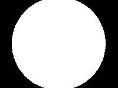
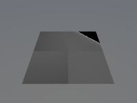
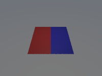

# Astroray

A modern C++17 physically based path tracer with a Blender addon and Python API.

---

## Gallery

<table>
<tr>
<td align="center" width="50%">

<sub><b>Cornell box</b> — NEE + MIS sampling</sub>
</td>
<td align="center" width="50%">

<sub><b>Disney BRDF grid</b> — metallic × roughness sweep</sub>
</td>
</tr>
<tr>
<td align="center" width="50%">

<sub><b>Black hole</b> — GR geodesic tracing, Novikov-Thorne disk</sub>
</td>
<td align="center" width="50%">

<sub><b>HDRI lighting</b> — environment map importance sampling</sub>
</td>
</tr>
<tr>
<td align="center" width="50%">

<sub><b>Area lights</b> — disk, rectangle, ellipse emitters</sub>
</td>
<td align="center" width="50%">

<sub><b>Normal mapping</b> — surface detail without extra geometry</sub>
</td>
</tr>
<tr>
<td align="center" width="50%">

<sub><b>Material comparison</b> — Lambert, Phong, Disney, Glass, Metal</sub>
</td>
<td align="center" width="50%">

<sub><b>Multi-material scene</b> — mixed BSDF types in one frame</sub>
</td>
</tr>
</table>

---

## Features

| Category | Capabilities |
|---|---|
| **Rendering** | Monte Carlo path tracing, NEE + MIS, RR termination |
| **Materials** | Disney/Principled BRDF, Lambert, Phong, Metal, Glass, Volumetrics |
| **Lights** | Point, directional (sun), area (disk/rect/ellipse/sphere), HDRI env maps |
| **Geometry** | Spheres, triangles/meshes, SAH BVH acceleration |
| **Textures** | Image, procedural (checker, noise, gradient, voronoi, brick, musgrave, …) |
| **Post-process** | Normal/bump mapping, pixel filters (Box/Gaussian/Blackman-Harris) |
| **Black holes** | GR geodesic tracing (RK45), Novikov-Thorne accretion disk, spectral emission |
| **Integration** | Standalone CLI, Python module (`astroray`), Blender addon |
| **Performance** | OpenMP tile parallelism, optional CUDA backend |

---

## Quick start

### Build (Linux/macOS)

```bash
python3 -m pip install -r requirements.txt
mkdir build && cd build
cmake .. -DCMAKE_BUILD_TYPE=Release
make -j$(nproc)
```

### Build (Windows — MSVC)

```cmd
mkdir build && cd build
cmake .. -DCMAKE_BUILD_TYPE=Release -DASTRORAY_ENABLE_CUDA=OFF
cmake --build . --config Release -j
```

See [docs/QUICKSTART.md](docs/QUICKSTART.md) for full platform-specific instructions, including the Blender addon build.

### Run tests

```bash
python3 -m pytest tests/ -v --tb=short
```

### Standalone render

```bash
./build/bin/raytracer --scene 1 --width 800 --height 600 --samples 64 --output output.png
```

### Python API

```python
import sys; sys.path.insert(0, "build")
import astroray

r = astroray.Renderer()
r.setup_camera([0, 0, 5], [0, 0, 0], [0, 1, 0], 60.0, 16/9, 0.0, 5.0, 800, 450)
mat = r.create_material("disney", [0.8, 0.4, 0.2], {"metallic": 0.4, "roughness": 0.3})
r.add_sphere([0, 0, 0], 1.0, mat)
img = r.render(samples_per_pixel=64, max_depth=8)
```

### Blender addon

```bash
# Build the installable .zip (auto-detects Blender + matching Python)
python scripts/build_blender_addon.py

# Build and install directly into Blender's extensions dir
python scripts/build_blender_addon.py --install
```

Then in Blender: `Edit > Preferences > Get Extensions > Install from Disk...`

---

## Repository layout

```
Astroray/
├── apps/                    # Standalone CLI entrypoint
├── blender_addon/           # Blender RenderEngine addon + shader_blending module
├── docs/                    # Docs, ADRs, images
├── include/                 # Header-only renderer core (raytracer.h, advanced_features.h)
│   └── astroray/            # GR subsystem (metric, integrator, accretion disk, spectral)
├── module/                  # pybind11 Python bindings
├── scripts/                 # build_blender_addon.py and other utilities
├── src/                     # C++/CUDA implementation units
├── tests/                   # pytest suite (66 tests)
└── CMakeLists.txt
```

---

## Documentation

- [Quickstart](docs/QUICKSTART.md) — build, test, Blender addon
- [Docs index](docs/README.md)
- [Scripts reference](scripts/README.md)
- [Contributing](CONTRIBUTING.md)

## License

MIT — see [LICENSE](LICENSE).
