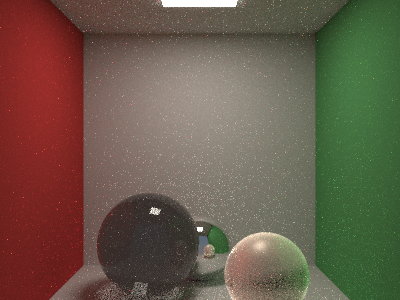
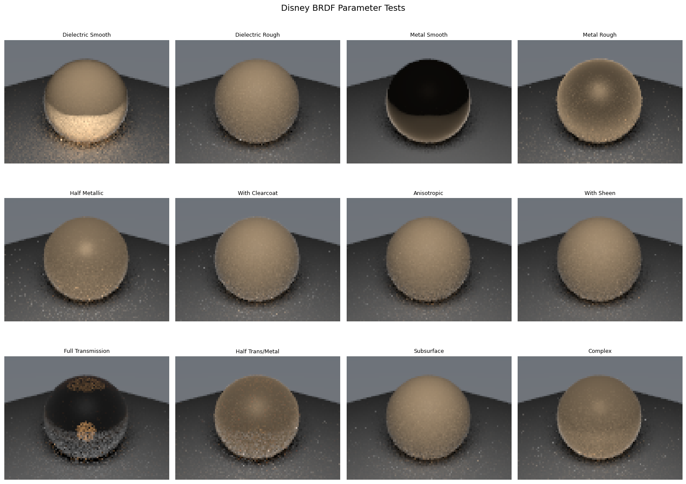
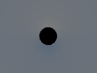

# Astroray

Astroray is a modern C++17 physically based path tracer with pybind11 Python bindings and Blender integration.

## Highlights

- Physically based Monte Carlo path tracing (NEE + MIS)
- SAH BVH acceleration
- Disney/Principled-style BRDF and multiple core material types
- Volumetrics, HDRI environment lighting, textures, normal/bump mapping
- General-relativistic black hole rendering
- Optional CUDA backend
- Standalone CLI + Python module + Blender addon bridge

## Repository structure

```
Astroray/
├── apps/                    # Standalone CLI entrypoint
├── blender_addon/           # Blender RenderEngine addon
├── docs/                    # Project docs, ADRs, workflow guides
├── include/                 # Header-only renderer core + advanced features
├── module/                  # pybind11 bindings (astroray module)
├── samples/                 # Sample assets/scenes
├── scripts/                 # Packaging and utility scripts
├── src/                     # C++/CUDA implementation units
├── tests/                   # pytest suite
└── CMakeLists.txt
```

## Build

```bash
python3 -m pip install -r requirements.txt
mkdir -p build && cd build
cmake .. -DCMAKE_BUILD_TYPE=Release
make -j8
```

Outputs:
- Python module: `build/astroray.cpython-*.so` (Linux) / `build/astroray.pyd` (Windows)
- Standalone binary: `build/bin/raytracer`

## Test

```bash
# Full suite
python3 -m pytest tests/ -v --tb=short

# Focused suites
python3 -m pytest tests/test_python_bindings.py -v
python3 -m pytest tests/test_material_properties.py -v
python3 -m pytest tests/test_standalone_renderer.py -v
```

Test artifacts are written to `test_results/` (gitignored).

## Usage

### Standalone renderer

```bash
./build/bin/raytracer --scene 1 --width 800 --height 600 --samples 64 --depth 50 --output output.png
```

Supported CLI flags: `--scene`, `--width`, `--height`, `--samples`, `--depth`, `--output`, `--help`.

### Python module

```python
import sys
sys.path.insert(0, "build")
import astroray

r = astroray.Renderer()
r.setup_camera([0,0,5], [0,0,0], [0,1,0], 60.0, 16/9, 0.0, 5.0, 800, 450)
mat = r.create_material("disney", [0.8, 0.4, 0.2], {"metallic": 0.4, "roughness": 0.3})
r.add_sphere([0, 0, 0], 1.0, mat)
img = r.render(samples_per_pixel=64, max_depth=8)
```

## Visual results

The following images were generated by the test suite and copied from `test_results/` for documentation:

| Cornell box | Disney BRDF grid |
|---|---|
|  |  |

| Black hole showcase |
|---|
|  |

## Documentation

- Docs index: `docs/README.md`
- Quickstart: `docs/QUICKSTART.md`
- Issue workflow: `docs/BEADS_WORKFLOW.md`
- Contributor guide: `CONTRIBUTING.md`
- Script reference: `scripts/README.md`

## License

MIT — see `LICENSE`.
