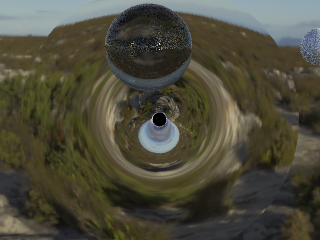
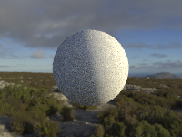
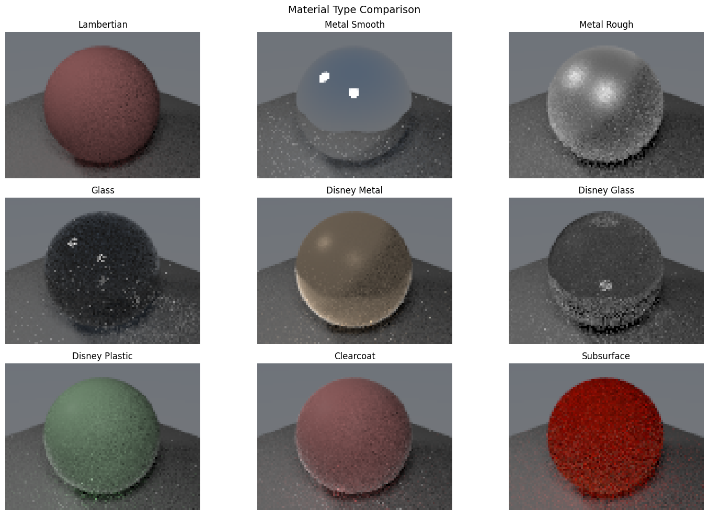

# Astroray

A modern C++17 physically based path tracer with a Blender addon and Python API.
Plugin-driven architecture — new materials, integrators, and post-process passes
drop in as single files.

---

## Gallery

<table>
<tr>
<td align="center" colspan="2">

<sub><b>General-relativistic black hole</b> — Kerr geodesic tracing, gravitational lensing, Novikov-Thorne accretion disk, HDRI environment</sub>
</td>
</tr>
<tr>
<td align="center" width="50%">

<sub><b>Cornell box</b> — path tracing with NEE + MIS, glass and Disney BRDF spheres</sub>
</td>
<td align="center" width="50%">

<sub><b>Disney BRDF</b> — metallic, roughness, clearcoat, transmission, subsurface sweep</sub>
</td>
</tr>
<tr>
<td align="center" width="50%">

<sub><b>HDRI lighting</b> — environment map importance sampling, specular response</sub>
</td>
<td align="center" width="50%">

<sub><b>Material library</b> — Lambertian, Metal, Glass, Disney, Subsurface in one scene</sub>
</td>
</tr>
</table>

---

## Features

| Category | Capabilities |
|---|---|
| **Rendering** | Monte Carlo path tracing, NEE + MIS, adaptive sampling, RR termination |
| **Materials** | Disney/Principled BRDF, Lambert, Phong, Metal, Glass, Subsurface, Volumetrics — all plugin-registered |
| **Lights** | Point, directional (sun), area (disk/rect/ellipse/sphere), HDRI env maps with importance sampling |
| **Geometry** | Spheres, triangles/meshes, SAH BVH; shapes are plugins |
| **Textures** | Image, Checker, Noise, Gradient, Voronoi, Brick, Musgrave, Wave, Magic — all plugins |
| **Integrators** | Path tracer, ambient occlusion — swap via `set_integrator(name)`; add custom integrators as single files |
| **Post-process** | Pass registry: OIDN denoiser, depth/normal/albedo AOV — add via `add_pass(name)` |
| **Black holes** | GR geodesic tracing (RK45/Dormand-Prince), Kerr metric, Novikov-Thorne disk, spectral emission |
| **Performance** | OpenMP tile parallelism, optional CUDA backend |
| **Integration** | Standalone CLI, Python module (`astroray`), Blender 5.1 addon |

---

## Quick start

### Build (Linux/macOS)

```bash
python3 -m pip install -r requirements.txt
mkdir build && cd build
cmake .. -DCMAKE_BUILD_TYPE=Release
make -j$(nproc)
```

### Build (Windows — MinGW/MSYS2)

```bash
mkdir build && cd build
cmake .. -G "MinGW Makefiles" -DCMAKE_BUILD_TYPE=Release -DASTRORAY_ENABLE_CUDA=OFF
cmake --build . -j
```

See [docs/QUICKSTART.md](docs/QUICKSTART.md) for full platform-specific instructions, including the Blender addon build.

### Run tests

```bash
python3 -m pytest tests/ -v --tb=short
```

### Standalone render

```bash
./build/bin/raytracer --scene 1 --width 800 --height 600 --samples 64 --output output.png
```

### Python API

```python
import sys; sys.path.insert(0, "build")
import astroray

r = astroray.Renderer()
r.setup_camera([0, 0, 5], [0, 0, 0], [0, 1, 0], 60.0, 16/9, 0.0, 5.0, 800, 450)

# Plugin-registered materials, integrators, passes
mat = r.create_material("disney", [0.8, 0.4, 0.2], {"metallic": 0.4, "roughness": 0.3})
r.add_sphere([0, 0, 0], 1.0, mat)
r.set_integrator("path_tracer")   # swap integrators by name
r.add_pass("oidn_denoiser")       # add post-process passes by name

img = r.render(samples_per_pixel=64, max_depth=8)

# Discover what's registered
print(astroray.material_registry_names())
print(astroray.integrator_registry_names())
print(astroray.pass_registry_names())
```

### Blender addon

```bash
# Build the installable .zip (auto-detects Blender + matching Python)
python scripts/build_blender_addon.py

# Build and install directly into Blender's extensions dir
python scripts/build_blender_addon.py --install
```

Then in Blender: `Edit > Preferences > Get Extensions > Install from Disk...`

---

## Repository layout

```
Astroray/
├── apps/                    # Standalone CLI entrypoint
├── blender_addon/           # Blender 5.1 RenderEngine addon
├── docs/                    # Docs, ADRs, agent context, images
├── include/                 # Header-only renderer core
│   ├── raytracer.h          # Vec3, Ray, Camera, BVH, Renderer, Framebuffer
│   ├── advanced_features.h  # Disney BRDF, transforms
│   └── astroray/            # Plugin interfaces & GR subsystem
│       ├── registry.h       # Registry<T> template
│       ├── register.h       # ASTRORAY_REGISTER_* macros
│       ├── integrator.h     # Integrator base class
│       ├── pass.h           # Pass base class
│       ├── param_dict.h     # Plugin parameter passing
│       └── …                # GR metric, accretion disk, spectral types
├── module/                  # pybind11 Python bindings
├── plugins/                 # Plugin implementations (drop-in files)
│   ├── integrators/         # path_tracer, ambient_occlusion
│   ├── materials/           # disney, lambertian, metal, dielectric, …
│   ├── passes/              # oidn_denoiser, depth_aov, normal_aov, albedo_aov
│   ├── shapes/              # sphere, triangle, mesh, black_hole, …
│   └── textures/            # checker, noise, voronoi, brick, …
├── scripts/                 # build_blender_addon.py and other utilities
├── tests/                   # pytest suite (227 collected tests as of 2026-04-28)
└── CMakeLists.txt
```

---

## Documentation

- [Quickstart](docs/QUICKSTART.md) — build, test, Blender addon
- [Docs index](docs/README.md)
- [Renderer internals](docs/agent-context/renderer-internals.md) — architecture, pipeline, material conventions
- [Contributing](CONTRIBUTING.md)

## License

MIT — see [LICENSE](LICENSE).
