# Astroray

A physically based path tracer with a plugin core, a spectral pipeline, a
Blender 5.1 addon, and a general-relativistic mode for astrophysical
scenes. C++17 / CUDA on the inside, pybind11 + Python API on the outside.

The design goal is **pluggability**: materials, shapes, lights, integrators,
textures, and post-process passes all register into small factory registries.
Adding a feature usually means dropping in one file.

<!-- Hero render: derive from a new Kerr + synchrotron-jet scene per pkg93.
     Target 1920×1080, ≥4096 SPP (offline). No checked-in source asset yet —
     see pkg93 for composition TODO. Falls back to a placeholder until pkg93
     produces the asset. -->
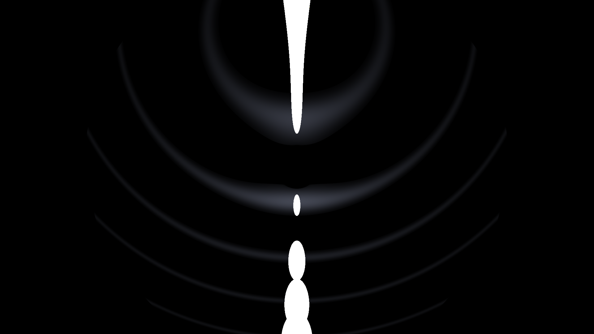

> A Kerr black hole with a relativistic jet. Geodesics traced in the Kerr
> metric (pkg40), validated against Bardeen-Press-Teukolsky 1972 and the
> Chandrasekhar analytic photon-sphere solutions (pkg41, 39 tests).
> Synchrotron emission from the bipolar jet follows Pandya et al. 2016
> power-law + thermal fits (pkg42). Spectral SED and gravitational
> redshift are unified through `MinkowskiMetric` + `SampledWavelengths::redshift`
> (pkg67).

---

## What's in the box

| Layer | What you get |
|---|---|
| **Core** | Plugin registries for integrators, materials, shapes, textures, lights, post-process passes. Each is a registry-discoverable name. |
| **Light transport** | Path tracing with NEE + MIS, Russian roulette, adaptive sampling. Spectral path tracer with Jakob-Hanika RGB→spectrum upsampling and CIE 1964 10° CMFs. Specular Manifold Sampling for spectral caustics. ReSTIR DI and Neural Radiance Caching are wired as plugin integrators (CPU only today). |
| **Materials** | Disney Principled BRDF with Kulla-Conty energy compensation tables (pkg60), Lambertian, Metal, Dielectric with Sellmeier dispersion, Subsurface, Emissive, Volumetric. CPU + GPU material capability metadata; no silent fallbacks. |
| **GR / astrophysics** | Kerr metric (pkg40, pkg41), Schwarzschild extraction, synchrotron emission with Pandya 2016 fits and bipolar relativistic jets (pkg42), slim disk accretion model (pkg43, Abramowicz 1988 / Sadowski 2009). Spectral wavelengths transport gravitational redshift through `MinkowskiMetric` (pkg67). |
| **Denoising** | OIDN persistent device with CUDA backend (pkg68), OptiX denoiser with HDR/AOV models (pkg70), OptiX temporal denoiser via motion vectors (pkg73). |
| **GPU** | CUDA **wavefront path tracer** (pkg55) — staged intersect/shade with material-sorted buckets, path regeneration, dedicated NEE shadow stage, any-hit shadow rays — measured **1.50× faster** than the previous megakernel on the 7-material gate scene, at per-channel image parity. Two-level BVH (TLAS/BLAS) instancing with transform-only refit (pkg114), GPU light tree for many-light scenes (pkg86-B), deformation motion blur (pkg88-C.0), multi-wavelength spectral rendering with measured CPU/GPU parity (pkg54 chain). |
| **Blender** | Blender 5.1 addon: viewport rendering at **Cycles-OPTIX parity** (in-Blender A/B: steady-state p99 0.84× Cycles, pkg81), depsgraph-driven incremental scene sync (pkg56), persistent viewport session (pkg52), native shader nodes (pkg57), **Cycles-parity procedural textures** — Noise/Voronoi/Wave/Brick/Magic/Gradient/Checker ported from Cycles SVM, bit-exact hash family (pkg115), HDRI/World parity (pkg63), automatic GPU instancing for repeated meshes (pkg114). |
| **I/O** | Pure-Python `.blend` reader walking Blender's SDNA — no `bpy` runtime dependency (pkg76). |

---

## Validation snapshot

Numbers below trace to merged PRs and to `.astroray_plan/docs/STATUS.md`.
All hardware-measured numbers are from the project workstation (NVIDIA RTX
5070 Ti, OptiX 9.1, CUDA 12.8).

| Validation | Measurement | Source |
|---|---|---|
| GPU wavefront vs megakernel | **1.50× faster** on the 7-material contact sheet (256² @ 512 spp, cool-run gate); image agreement per-channel ratio 0.997 | pkg55 Phase B′, PR #459; re-measured 2026-06-12 |
| In-Blender viewport vs Cycles | Steady-state pan-frame **p99 = 0.84× Cycles-OPTIX** (target ≤ 1.2×), p50 0.98× — 99,458-tri scene, Blender 5.1 A/B | pkg81, PR #463 |
| Instancing TLAS refit | Transform-only edit re-uploads **19.5%** of a full geometry upload (≤ 50% gate); refit byte-identical to a full rebuild | pkg114, PR #468 |
| GPU light tree | Pick parity **≥ 99.5%** vs CPU tree over 10k queries; 0.09–0.5 ms upload @ 10k lights | pkg86-B, PR #434 |
| Cycles parity (Cornell, CPU) | SSIM **0.9536** vs Cycles 4.x CPU EXR reference | pkg71 |
| Cycles parity (Cornell, GPU) | SSIM **0.9548** vs Cycles CPU EXR; **5.2× faster** than Cycles-CUDA on Cornell | pkg71 |
| Kerr geodesic validation | **39 tests** — BPT 1972 + Chandrasekhar analytic + null circular photon residuals + Kerr a=0 vs Schwarzschild identity + shadow-contour image-plane regression | pkg41, PR #236 |
| Multi-wavelength CPU/GPU parity | Visible-band SSIM **0.999263** at 8192 spp | pkg54c |
| Spectral caustics (prism, SMS) | **+8.83 dB PSNR** vs path-tracer baseline; 1.18× receiver-energy ratio; 2.0% empty-hook overhead | pkg64 Phases 1+2+3 |
| OIDN viewport denoise | **2.77× viewport speedup** at 256×256 vs first-call init cost | pkg68 + pkg75 |
| OptiX denoiser | **1.86× faster** than OIDN-CUDA at 1080p; SSIM(OptiX, OIDN) = 0.9987 | pkg70 |
| OptiX temporal denoise | **53.1% inter-frame variance reduction** vs ≥30% gate | pkg73, PR #249 |
| Slim disk accretion | T(9M, ṁ=1) = **7.45×10⁶ K**; 14/14 tests vs Abramowicz 1988 / Sadowski 2009 | pkg43, PR #271 |
| Cold-start viewport latency | First frame **83.3 ms** (was 12,079 ms before pkg84) — **145× improvement** | pkg84, PR #260 |
| Test suite | **1563 passed / 0 failed** (68 skipped, 26 xfailed, 2 xpassed) on the Windows `build_cuda` (Ninja, native sm_120) configuration, RTX-verified | full local sweep, 2026-08-06 |

---

## Gallery

<!-- All gallery tiles are produced by scripts/diagnostics/render_readme_gallery.py
     (live renders; see each tile function for scene + integrator details). -->
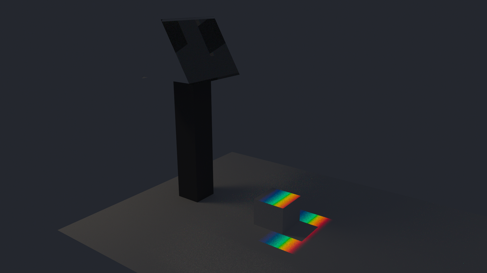

> **Spectral prism dispersion.** A collimated sun through a BK7 prism:
> every sampled wavelength refracts by its own Sellmeier IOR (pkg31) and
> lands at its own spot — the camera is zoomed onto the resulting
> red→violet band. The spectrum is real transport, not a gradient:
> forward photon deposition (Jensen 1996, pkg109/110/111), which renders
> flat-prism dispersion noise-free where camera-side specular connections
> cannot. For *focusing* casters (spheres, lenses) the engine additionally
> has Specular Manifold Sampling folded into the path tracer (pkg64,
> +8.83 dB PSNR receipt) and MNEE (pkg106).

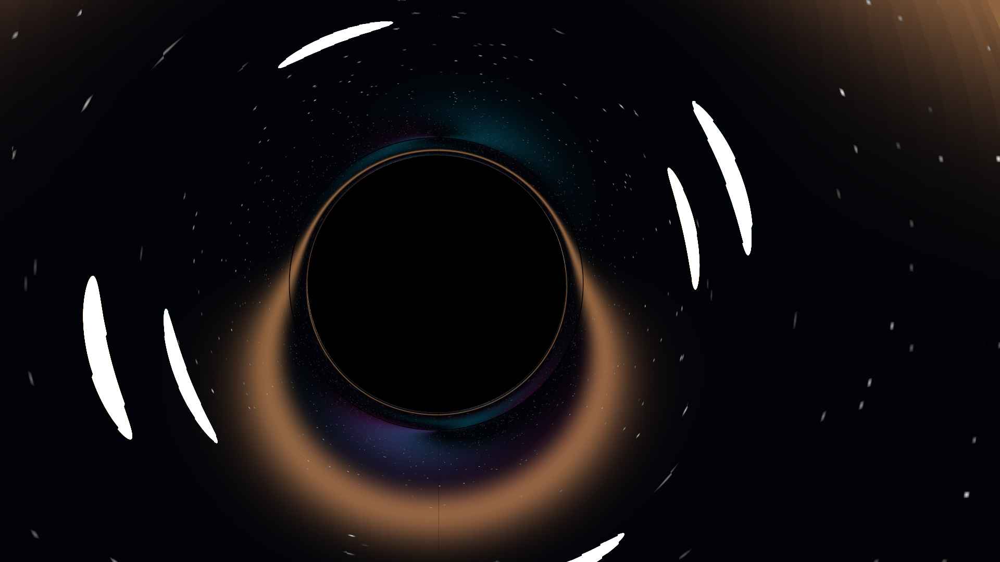

> **Pure spacetime curvature.** A bare Schwarzschild black hole — no
> accretion disk — bending a nebula sky, a starfield, and three emissive
> spheres placed behind it. Camera geodesics are integrated through the
> metric (pkg40, validated against Bardeen-Press-Teukolsky 1972, pkg41);
> background light piles up into the photon ring around the shadow and the
> spheres smear into the bright arcs.

<table>
<tr>
<td align="center" width="50%">
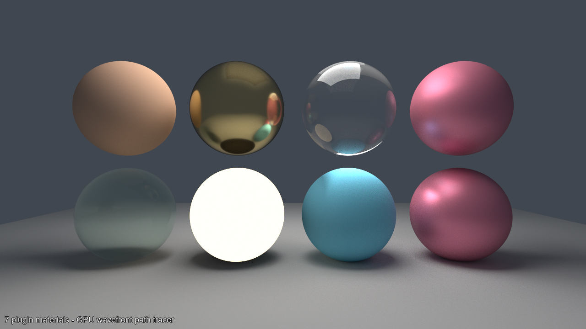
<sub><b>Material contact sheet</b> — the seven wavefront material buckets (lambertian, metal, dielectric, Disney, thin glass, emitter, closure matte) on one sheet, rendered by the GPU wavefront path tracer at 2048 spp. This is the pkg55 perf-gate scene.</sub>
</td>
<td align="center" width="50%">
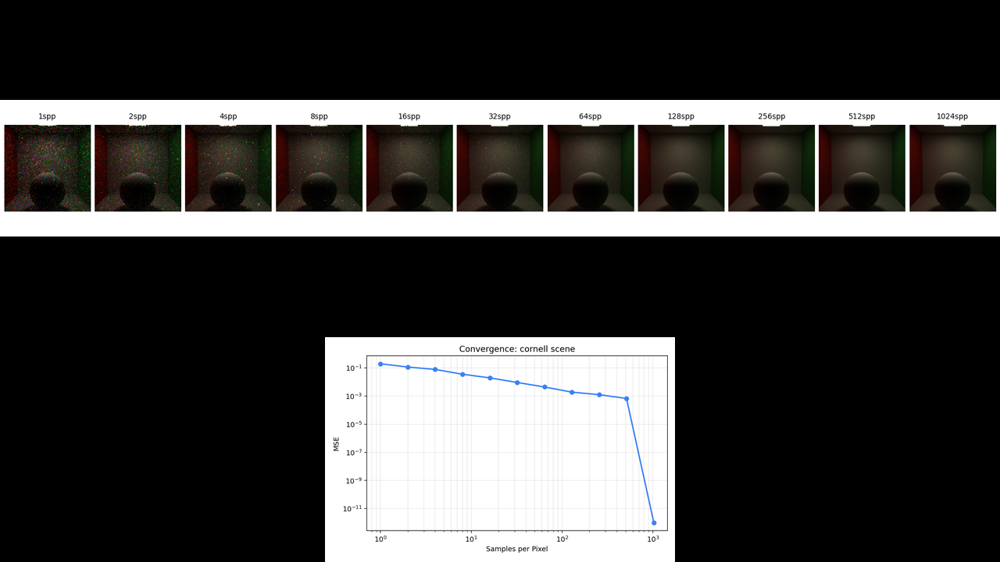
<sub><b>Convergence — Cornell 1→1024 spp.</b> Log-log RMSE slope measured −0.492 vs the −0.5 Monte Carlo ideal, against an independent 8192-spp reference (separate seed).</sub>
</td>
</tr>
<tr>
<td align="center" width="50%">
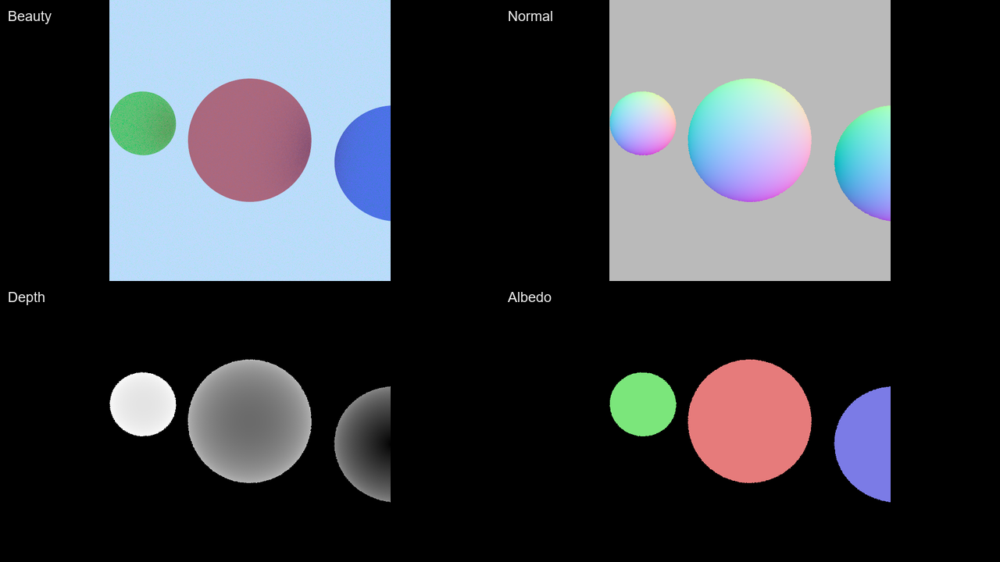
<sub><b>AOV stack.</b> Beauty + first-hit normal + depth + albedo + adaptive-sampling heatmap + bounce heatmap, all from the default integrator. Drives OIDN and OptiX guide inputs (pkg69, pkg75).</sub>
</td>
<td align="center" width="50%">
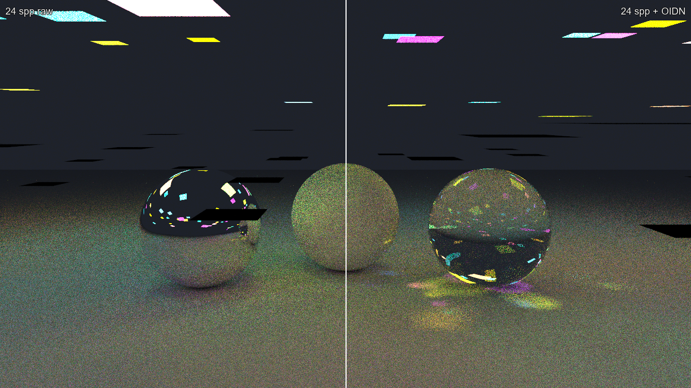
<sub><b>Denoisers, three ways.</b> One 24-spp render of a 70-fairy-light scene split in thirds: OIDN (pkg68) on the left, the raw Monte Carlo input in the centre, the OptiX AI denoiser (pkg70) on the right. SSIM(OptiX, OIDN) = 0.9987.</sub>
</td>
</tr>
<tr>
<td align="center" width="50%">
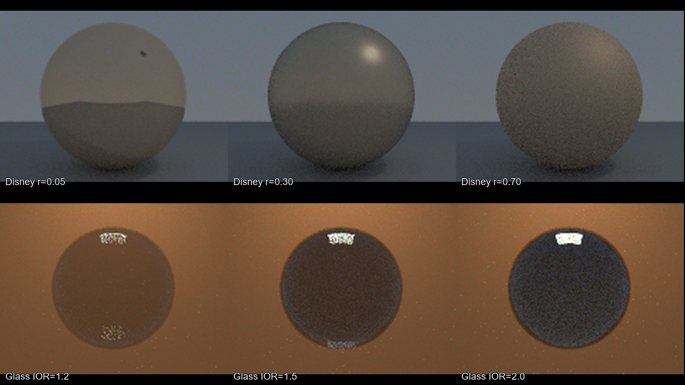
<sub><b>Material sweep at golden hour.</b> Gold Disney spheres sweep roughness 0.03→0.75 (mirror-sharp to brushed) while glass spheres sweep IOR 1.2 / 1.5 / 2.0, under one HDRI sunset on a glossy floor. Kulla-Conty energy compensation ported from Cycles (pkg60); worst-case hemispherical reflectance 1.0159 over 90 furnace tests.</sub>
</td>
<td align="center" width="50%">
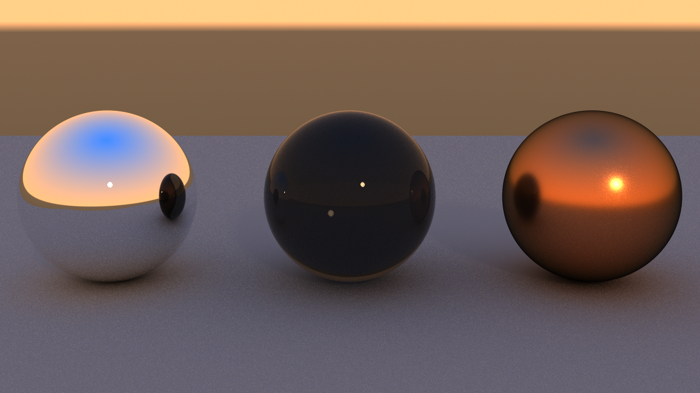
<sub><b>HDRI environment + MIS.</b> Importance-sampled environment with Mapping XYZ rotation, color tint, and MIS env-map (pkg63). Spectral atlas via Jakob-Hanika upsampling (pkg14).</sub>
</td>
</tr>
<tr>
<td align="center" width="50%">
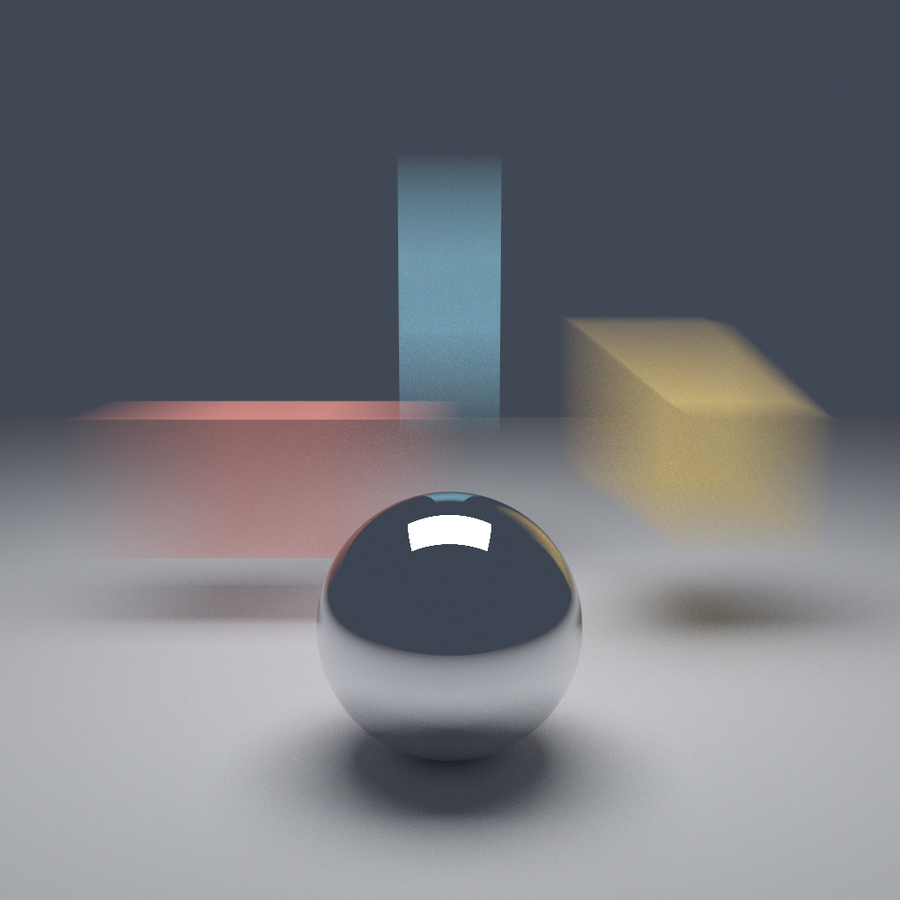
<sub><b>Deformation motion blur.</b> Per-vertex start/end positions with a time-aware BVH (pkg88-C.0, Cycles-style linear interpolation): three translating boxes streak while the static chrome sphere stays sharp. GPU render 15× faster than CPU on this scene.</sub>
</td>
<td align="center" width="50%">
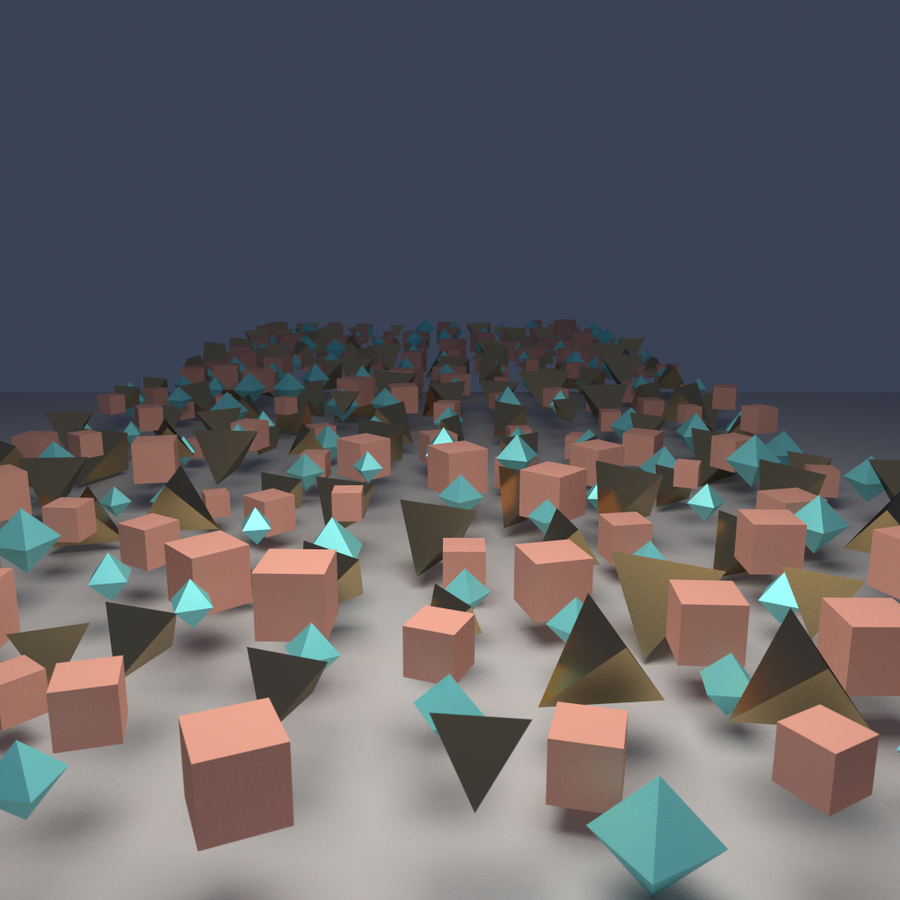
<sub><b>Instancing + two-level BVH.</b> 432 instances of three meshes share one BLAS each under a TLAS (pkg114) — 28 unique GPU primitives in total; transform-only edits re-upload just the TLAS (19.5% of a full upload).</sub>
</td>
</tr>
</table>

---

## Quick start

### Build (Linux / macOS)

```bash
python3 -m pip install -r requirements.txt
mkdir build && cd build
cmake .. -DCMAKE_BUILD_TYPE=Release
make -j$(nproc)
```

### Build (Windows — MinGW / MSYS2)

```bash
mkdir build && cd build
cmake .. -G "MinGW Makefiles" -DCMAKE_BUILD_TYPE=Release -DASTRORAY_ENABLE_CUDA=OFF
cmake --build . -j
```

### Build (Windows — CUDA)

The repo ships CMake presets for the CUDA developer build. In VS Code
with the CMake Tools extension, select the `windows-cuda-vs` configure
preset and build with `windows-cuda-vs-release`. OIDN is enabled in
these presets; CMake uses a local OIDN install when present or fetches
the Windows prebuilt package during configure. For day-to-day builds,
`scripts/build/build_cuda.bat` (Ninja + sccache) is faster — see
[docs/DEVELOPMENT.md](docs/DEVELOPMENT.md).

**Optional GPU dependencies** — auto-detected by CMake; quietly disabled
if absent:

- **CUDA Toolkit 12.x** — GPU path tracer + OIDN-CUDA denoiser backend.
- **NVIDIA OptiX 8.x or 9.x SDK** — OptiX AI denoiser backend
  (~1.86× faster than OIDN-CUDA on Tensor Core GPUs, measured on RTX
  5070 Ti / OptiX 9.1.0). Manual download from
  <https://developer.nvidia.com/designworks/optix/download> (NVIDIA
  developer account required; OptiX SDK License forbids redistribution
  so we cannot bundle it). The default install path
  `C:\ProgramData\NVIDIA Corporation\OptiX SDK 9.x.x\` is auto-detected.
  Without OptiX, the denoiser silently falls back to OIDN.

See [docs/QUICKSTART.md](docs/QUICKSTART.md#optional-nvidia-gpu-users) for
the full prerequisite list.

```powershell
cmake --preset windows-cuda-vs
cmake --build --preset windows-cuda-vs-release

# Optional: build the artifacts and run pytest through the repo bootstrap.
cmake --build --preset windows-cuda-vs-pytest
```

Artifacts land in `build_cuda/`: the Python module is in
`build_cuda/Release/` for Visual Studio builds, and the standalone
binaries are in `build_cuda/bin/Release/`. (An opt-in experimental
tiny-cuda-nn neural-cache build is available via the `windows-tcnn-vs`
presets.)

See [docs/QUICKSTART.md](docs/QUICKSTART.md) for full platform-specific
instructions, including the Blender addon build.

### Run tests

```bash
python3 -m pytest tests/ -v --tb=short

# Recommended on Windows (resolves DLL dirs + the right .pyd):
python scripts/dev/run_tests.py --build-dir build_cuda -- tests -q --tb=short
```

See [docs/DEVELOPMENT.md](docs/DEVELOPMENT.md) for the full developer
workflow — the two-build story (test build vs OpenMP-free Blender addon
build), perf-gate calibration notes, and the known Windows footguns.

### Standalone render

```bash
# Linux/macOS
./build/bin/raytracer --scene 1 --width 800 --height 600 --samples 64 --output output.png

# Windows (the exe needs the OIDN + CUDA runtime DLLs on PATH)
build_cuda\bin\Release\raytracer.exe --scene 1 --width 800 --height 600 ^
    --samples 128 --device gpu --integrator wavefront_path_tracer --output output.png
```

### Python API

```python
import sys; sys.path.insert(0, "build")
import astroray

r = astroray.Renderer()
r.setup_camera([0, 0, 5], [0, 0, 0], [0, 1, 0], 60.0, 16/9, 0.0, 5.0, 800, 450)

# Plugin-registered materials, integrators, passes
mat = r.create_material("disney", [0.8, 0.4, 0.2],
                        {"metallic": 0.4, "roughness": 0.3})
r.add_sphere([0, 0, 0], 1.0, mat)
r.set_integrator("path_tracer")   # swap integrators by name
r.add_pass("oidn_denoiser")       # add post-process passes by name

img = r.render(samples_per_pixel=64, max_depth=8)

# Discover what's registered
print(astroray.material_registry_names())
print(astroray.integrator_registry_names())
print(astroray.pass_registry_names())
```

### Blender addon

```bash
# Build the installable .zip (auto-detects Blender + matching Python)
python scripts/build/build_blender_addon.py

# Build and install directly into Blender's extensions dir
python scripts/build/build_blender_addon.py --install
```

Then in Blender: `Edit > Preferences > Get Extensions > Install from Disk...`

---

## Repository layout

```
Astroray/
├── apps/                    # Standalone CLI entrypoint
├── blender_addon/           # Blender 5.1 RenderEngine addon
├── docs/                    # Docs, ADRs, agent context, images, renders
├── include/                 # Header-only renderer core
│   ├── raytracer.h          # Vec3, Ray, Camera, BVH, Renderer, Framebuffer
│   ├── advanced_features.h  # Disney BRDF, transforms
│   └── astroray/            # Plugin interfaces & GR subsystem
│       ├── registry.h       # Registry<T> template
│       ├── register.h       # ASTRORAY_REGISTER_* macros
│       ├── integrator.h     # Integrator base class
│       ├── pass.h           # Pass base class
│       ├── param_dict.h     # Plugin parameter passing
│       └── ...              # GR metric, accretion disk, spectral types
├── module/                  # pybind11 Python bindings
├── plugins/                 # Plugin implementations (drop-in files)
│   ├── integrators/         # path_tracer, ambient_occlusion, restir_di, neural_cache
│   ├── materials/           # disney, lambertian, metal, dielectric, ...
│   ├── passes/              # oidn_denoiser, optix_denoiser, depth/normal/albedo AOV
│   ├── shapes/              # sphere, triangle, mesh, black_hole, ...
│   └── textures/            # checker, noise, voronoi, brick, ...
├── src/gpu/                 # CUDA wavefront pipeline + megakernel
├── scripts/                 # Build, dev, benchmark, diagnostic helpers
├── tests/                   # pytest suite (1299 passing on build_cuda)
├── .astroray_plan/          # Roadmap, package specs, research notes
└── CMakeLists.txt
```

---

## Documentation

- [Quickstart](docs/QUICKSTART.md) — build, test, Blender addon
- [Development setup](docs/DEVELOPMENT.md) — two-build story, perf-gate calibration, Windows footguns
- [Docs index](docs/README.md)
- [Renderer internals](docs/agent-context/renderer-internals.md) — architecture, pipeline, material conventions
- [Roadmap](.astroray_plan/docs/ROADMAP.md) and [Status](.astroray_plan/docs/STATUS.md)
- [Contributing](CONTRIBUTING.md)

## References

The project follows a strict "no invented algorithms" policy
([CLAUDE.md §6](CLAUDE.md)). Key references:

- **Cycles** (Apache-2.0) — material model, denoising glue, viewport sync patterns
- **PBRT-v4** (Apache-2.0) — spectral path tracer, sampler design, AnimatedTransform
- **Jakob & Hanika 2019** — RGB → spectrum upsampling
- **Bardeen, Press & Teukolsky 1972** + **Chandrasekhar 1983** — Kerr geodesic validation gates
- **Pandya et al. 2016** — synchrotron emissivity fits
- **Abramowicz 1988** / **Sadowski 2009** — slim disk accretion
- **Kulla & Conty 2017** / **Burley 2015** — Disney BRDF energy compensation

Per-package research notes live in
[`.astroray_plan/docs/`](.astroray_plan/docs/).

## License

MIT — see [LICENSE](LICENSE).
